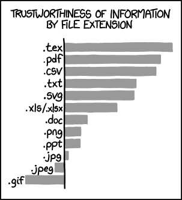

# Using `pandoc`

[`pandoc`](https://pandoc.org/) is a "universal document converter".  If you
ever have a bunch of documents in one format (like .html) that you want to
convert to another (like .pdf), you can use Pandoc for it!



# Installation

Pandoc isn't installed by default (usually).  You can install it by following
the instructions from [its installation
webpage](https://pandoc.org/installing.html).

## Basic Usage

We can ask pandoc to convert an input file format into an output file format.
It'll normally figure out what to do automatically.

```sh
pandoc input.txt -o output.docx
```

## HTML Files

One really useful use-case for `pandoc` is converting files to HTML for use on
a website. We can do this the normal way:

```sh
pandoc input.txt -o output.html
```

However, this won't work correctly in a web browser!  By default, `pandoc`
creates an HTML _fragment_, a piece of an HTML file which can be embedded in
a bigger file.  To create an HTML file that "stands alone", we have to give it
the `--standalone` flag:

```sh
pandoc input.txt --standalone -o output.html
```

Pandoc might also warn you that the document needs a title.  This can be
specified directly in some input formats (using what's called "frontmatter",
extra metadata which isn't part of the file itself), or it can be specified on
the command line using `--metadata title="..."`.

## More Info

The [Pandoc demo page](https://pandoc.org/demos.html) has a ton of examples.
